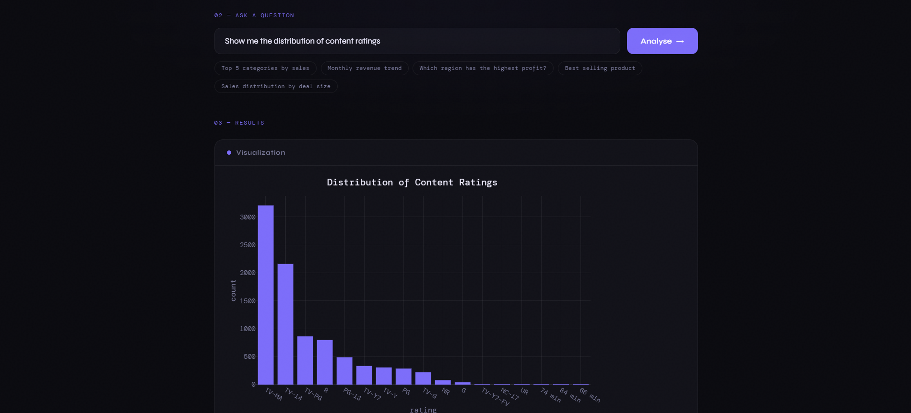

# AI Data Analyst System

An intelligent, agent-based data analysis platform that enables users to upload structured datasets (CSV) and interact with them using natural language queries. The system employs a multi-agent architecture powered by large language models to interpret user intent, generate execution plans, and deliver both visualizations and narrative insights.

## Screenshot


## Architecture Overview

The system implements a deterministic data pipeline followed by an agentic orchestration layer:

1. **Data Pipeline** – Ingests CSV files, normalizes column names, infers data types, cleans missing values, and extracts schema metadata.
2. **Storage Layer** – Persists datasets as Parquet files with SQLite-managed metadata.
3. **Planner Agent** – Translates natural language questions into structured execution plans using an LLM.
4. **Orchestrator** – Coordinates specialized agents and manages data flow.
5. **Execution Agents**:
   - **Query Agent** – Performs deterministic data transformations (filtering, grouping, aggregation)
   - **Visualization Agent** – Generates Plotly charts based on plan specifications
   - **Insight Agent** – Produces human-readable analytical summaries
6. **Tool Layer** – Provides controlled access to Pandas and Plotly operations.

## Technical Specifications

### Core Technologies

| Component | Technology |
|-----------|------------|
| API Framework | FastAPI |
| LLM Integration | OpenAI GPT-4o |
| Data Processing | Pandas, NumPy |
| Data Storage | Parquet + SQLite |
| Visualization | Plotly (Python/JS) |
| Frontend | HTML5, JavaScript |
| Deployment | Railway |

### Prerequisites

- Python 3.9 or higher
- OpenAI API key

## Installation

```bash
# Clone the repository
git clone <repository-url>
cd AI_Data_Analyser

# Create and activate virtual environment
python -m venv venv
source venv/bin/activate          # Linux/macOS
venv\Scripts\activate             # Windows

# Install dependencies
pip install -r requirements.txt

# Configure API key
export OPENAI_API_KEY="your-api-key"     # Linux/macOS
$env:OPENAI_API_KEY="your-api-key"       # Windows

# Running the Application
uvicorn api:app --reload
# Access the interface at http://localhost:8000
```
## API Endpoints

| Method | Endpoint | Description | Response |
|--------|----------|-------------|----------|
| `POST` | `/upload` | Upload CSV file | `{dataset_id, filename, schema, metadata}` |
| `POST` | `/analyse` | Submit natural language query | `{insight, chart, steps, success}` |
| `GET` | `/datasets` | List all stored datasets | `[{dataset_id, metadata, created_at}]` |
| `GET` | `/` | Serve web interface | HTML |

## Supported Query Types

| Category      | Example |
|--------------|--------|
| Aggregation   | "What is the average sales per region?" |
| Ranking       | "What are the top 5 products by total sales?" |
| Filtering     | "Show all orders where sales exceed 1000" |
| Time Series   | "What is the monthly revenue trend?" |
| Distribution  | "Show the sales distribution by category" |
| Conditional   | "What is the average profit in the Electronics category?" |

## Project Structure
AI_Data_Analyser/

├── api.py # FastAPI application entry point

├── index.html # Web interface

├── data_pipeline.py # Data ingestion and preprocessing

├── data_store.py # Storage abstraction layer

├── planner_agent.py # LLM-based planning agent

├── orchestrator.py # Agent coordination and workflow

├── agents.py # Specialized agents and tool implementations

├── requirements.txt # Python dependencies

├── data/ # Parquet data directory

└── README.md